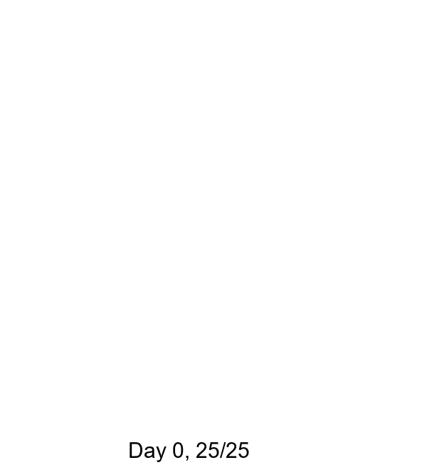
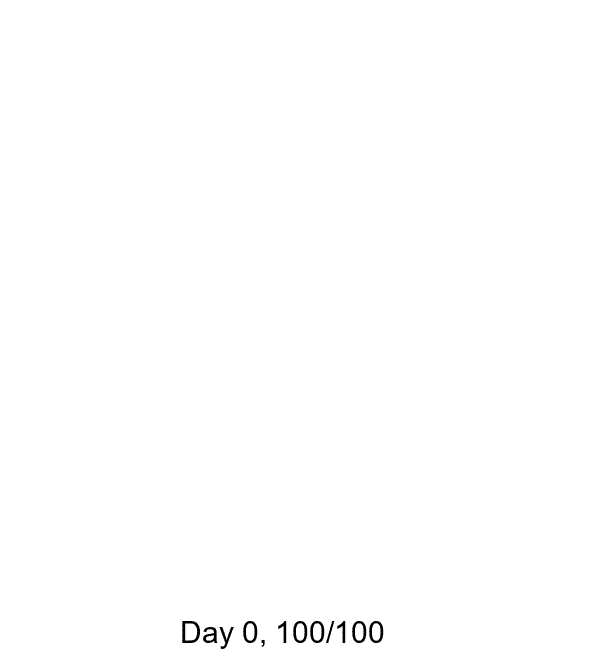

# 문제 링크

https://gall.dcinside.com/board/view/?id=programming&no=1703802

# 알고리즘

매 초의 상황을 Flood fill을 이용해서 O(A^2)에 처리 가능. [이 문제](https://www.acmicpc.net/problem/16000)의 아이디어와 비슷하게 써서 영역의 분리를 O(B)에 할 수는 있으나 어차피 모든 서버를 매번 훑어야할 것으로 보여 더 효율적인 방법이 있지는 않을 것으로 보임

# GUI

PIL을 이용. 아래는 그림 예시. 더 많은 예시는 results 폴더 참고.

## A = 5, B = 1



## A = 10, B = 5



## A = 100, B = 100


## A = 200, B = 400


# 보너스 조건

```
****** A 5 B 1 ******
Case #0: Day 13
Case #1: Day 8
Case #2: Day 9
Case #3: Day 10
Case #4: Day 13
Case #5: Day 10
Case #6: Day 9
Case #7: Day 12
Case #8: Day 13
Case #9: Day 9
Avg : 10.6
****** A 10 B 5 ******
Case #0: Day 9
Case #1: Day 10
Case #2: Day 7
Case #3: Day 7
Case #4: Day 9
Case #5: Day 9
Case #6: Day 7
Case #7: Day 9
Case #8: Day 8
Case #9: Day 9
Avg : 8.4
****** A 100 B 100 ******
Case #0: Day 39
Case #1: Day 38
Case #2: Day 39
Case #3: Day 39
Case #4: Day 39
Case #5: Day 38
Case #6: Day 40
Case #7: Day 39
Case #8: Day 39
Case #9: Day 40
Avg : 39
****** A 200 B 400 ******
Case #0: Day 39
Case #1: Day 39
Case #2: Day 39
Case #3: Day 40
Case #4: Day 39
Case #5: Day 39
Case #6: Day 39
Case #7: Day 40
Case #8: Day 39
Case #9: Day 38
Avg : 39.1
```

좋은 문제 내주셔서 감사합니다 ^___^